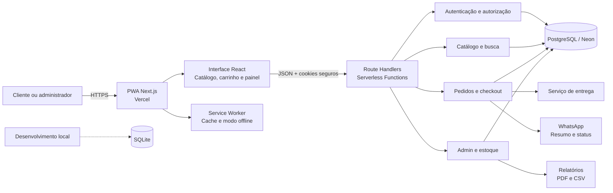
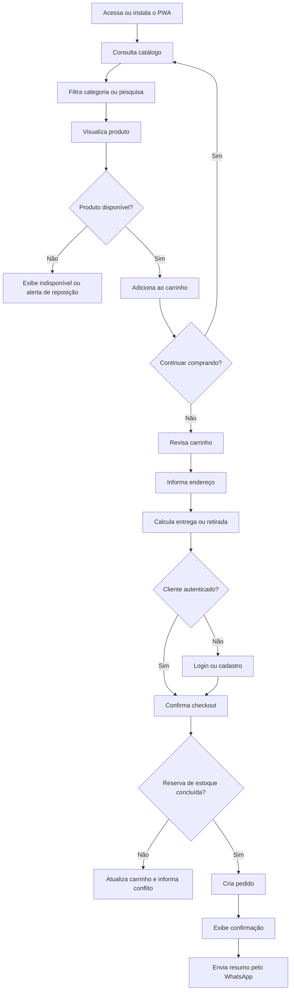
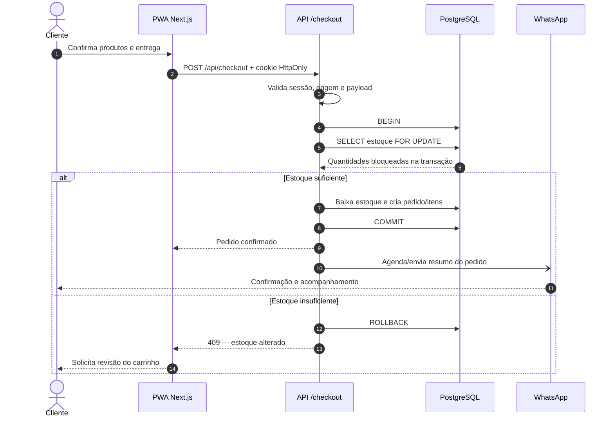
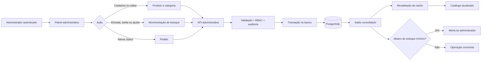
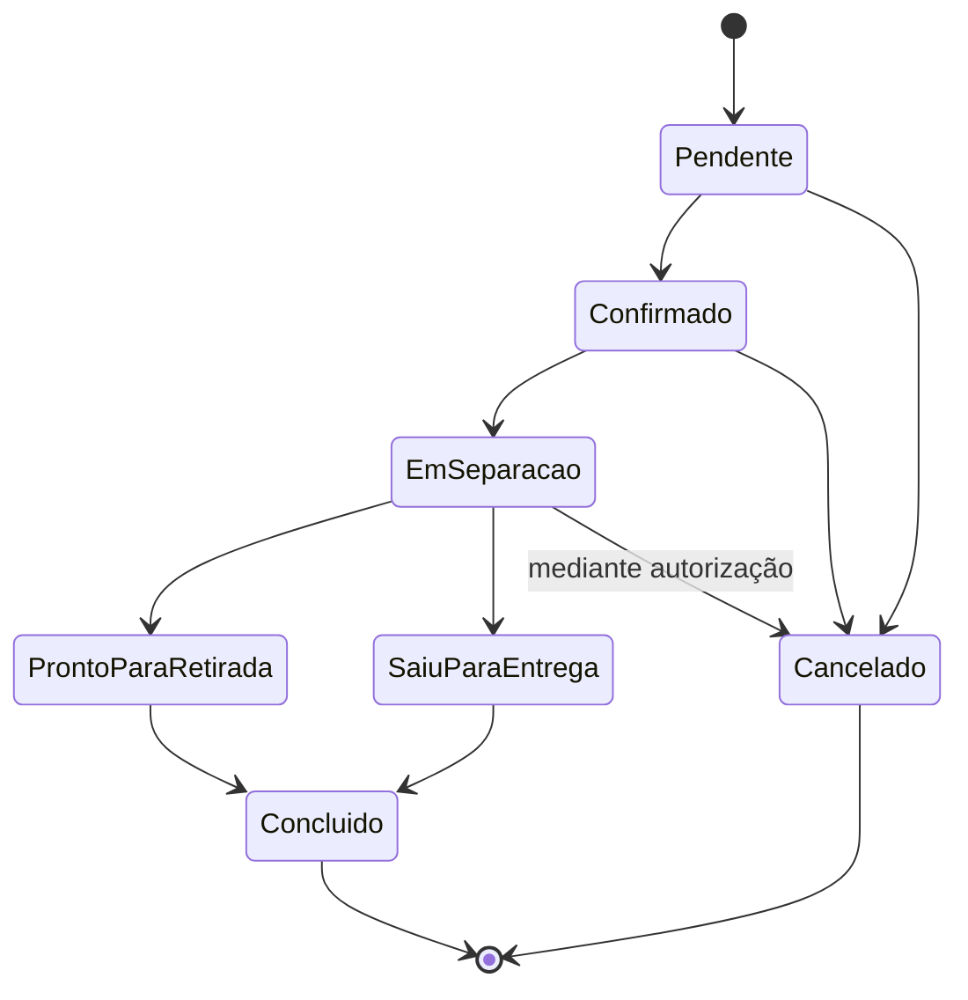
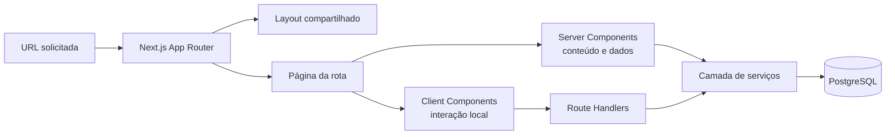

# Visão ilustrativa do sistema comercial PWA

Este documento apresenta a visão inicial do sistema para alinhar escopo, fluxos e responsabilidades antes da implementação.

## 1. Arquitetura geral



## 2. Jornada do cliente



## 3. Sequência segura do checkout



## 4. Fluxo administrativo e atualização de estoque



## 5. Mapa dos módulos

```text
Sistema comercial PWA
├── Loja do cliente
│   ├── Início e categorias
│   ├── Busca e filtros
│   ├── Detalhe do produto
│   ├── Carrinho
│   ├── Endereço e entrega/retirada
│   ├── Login e cadastro
│   ├── Checkout
│   └── Pedidos e acompanhamento
├── PWA
│   ├── Instalação no celular/desktop
│   ├── Manifest e ícones
│   ├── Cache da interface e catálogo recente
│   ├── Página offline
│   └── Sincronização ao recuperar conexão
├── Administração
│   ├── Dashboard
│   ├── Produtos e categorias
│   ├── Entradas, saídas e ajustes de estoque
│   ├── Pedidos e mudança de status
│   ├── Clientes e endereços
│   ├── Alertas de estoque mínimo
│   └── Relatórios PDF/CSV
├── Backend
│   ├── Autenticação JWT em cookie HttpOnly
│   ├── Catálogo e busca
│   ├── Carrinho e checkout
│   ├── Entregas e taxas
│   ├── Pedidos
│   ├── Estoque transacional
│   └── APIs administrativas com RBAC
├── Dados
│   ├── usuarios
│   ├── enderecos
│   ├── categorias
│   ├── produtos
│   ├── estoque
│   ├── movimentacoes_estoque
│   ├── pedidos
│   ├── itens_pedido
│   └── auditoria
└── Integrações
    ├── WhatsApp
    ├── Cálculo de entrega
    ├── Checkout/pagamentos (opcional)
    └── Exportação de relatórios
```

## 6. Telas sugeridas

### Cliente

1. Home com categorias “Residencial” e “Automotivo”.
2. Catálogo com pesquisa, filtros e indicador de disponibilidade.
3. Produto com fotos, preço, descrição, variações e quantidade.
4. Carrinho com subtotal, edição de quantidades e estimativa de entrega.
5. Checkout em etapas curtas: identificação, endereço, entrega e confirmação.
6. Confirmação com número do pedido e ação para abrir o WhatsApp.
7. Área “Meus pedidos” com linha do tempo de status.

### Administração

1. Dashboard com vendas, pedidos pendentes e produtos com estoque baixo.
2. Lista e formulário de produtos.
3. Tela de estoque com saldo, estoque mínimo e histórico de movimentações.
4. Quadro/lista de pedidos por status.
5. Detalhe do pedido com cliente, itens, entrega e histórico.
6. Relatórios com período, filtros e exportação.

## 7. Estados principais do pedido



## 8. Diretrizes iniciais

- O servidor sempre recalcula preços, frete e total; valores enviados pelo navegador nunca são confiáveis.
- A baixa de estoque ocorre em transação, junto com a criação do pedido.
- Toda movimentação de estoque gera histórico auditável, em vez de apenas sobrescrever o saldo.
- O catálogo pode usar cache, mas checkout e painel de estoque devem consultar dados consistentes.
- WhatsApp não deve ser a única fonte de verdade: o pedido e seu histórico ficam no banco.
- O modo offline permite consultar conteúdo já armazenado, mas não confirma pedidos sem conexão.

## 9. Modelo de aplicação: MPA com Next.js App Router

### O que significa MPA neste projeto

O sistema será organizado como uma **MPA (Multi-Page Application)**: cada área importante possui uma URL, uma página e uma responsabilidade próprias. Catálogo, produto, carrinho, checkout, pedidos e administração não serão estados escondidos dentro de uma única tela monolítica.

O Next.js mantém a experiência rápida de navegação do React: o primeiro acesso e uma atualização direta podem ser renderizados pelo servidor, enquanto transições internas feitas com `Link` são otimizadas e não exigem recarregar toda a interface. Portanto, adotaremos uma arquitetura MPA por rotas, com navegação progressiva e componentes interativos somente onde forem necessários.



### Estrutura de rotas planejada

```text
app/
├── (loja)/
│   ├── page.tsx                       # Home
│   ├── catalogo/page.tsx              # Catálogo e filtros
│   ├── produtos/[slug]/page.tsx       # Detalhe do produto
│   ├── carrinho/page.tsx              # Carrinho
│   ├── checkout/page.tsx              # Identificação e entrega
│   ├── checkout/confirmacao/page.tsx  # Resultado do pedido
│   └── pedidos/[id]/page.tsx          # Acompanhamento
├── (autenticacao)/
│   ├── entrar/page.tsx
│   └── cadastro/page.tsx
├── admin/
│   ├── layout.tsx                     # Proteção e navegação administrativa
│   ├── page.tsx                       # Dashboard
│   ├── produtos/page.tsx
│   ├── estoque/page.tsx
│   ├── pedidos/page.tsx
│   └── relatorios/page.tsx
└── api/
    ├── auth/...
    ├── produtos/...
    ├── checkout/...
    ├── pedidos/...
    └── admin/...
```

Os grupos `(loja)` e `(autenticacao)` organizam o código sem aparecer na URL. A área `/admin` terá layout próprio e validação de sessão e papel de usuário no servidor.

### Como o modelo será implementado

1. **Server Components por padrão:** páginas de catálogo, produto, pedidos e dashboard buscarão dados no servidor. Isso reduz JavaScript enviado ao navegador e evita expor acesso direto ao banco.
2. **Client Components pontuais:** busca instantânea, seletores de quantidade, carrinho, formulários e feedback visual usarão `"use client"` apenas no menor componente interativo possível.
3. **URLs reais e compartilháveis:** filtros relevantes usarão parâmetros como `/catalogo?categoria=automotivo&busca=cera`; produtos usarão slugs estáveis.
4. **Layouts por domínio:** a loja compartilhará cabeçalho, navegação e carrinho; o admin terá menu e controle de acesso independentes.
5. **Route Handlers para comandos:** login, checkout, alterações administrativas e integrações passarão por `/api/...`, com Zod, autenticação, autorização, rate limit e transações.
6. **Leitura no servidor:** Server Components poderão chamar a camada de serviço diretamente. Não faremos uma requisição HTTP da aplicação para a própria API apenas para ler dados durante a renderização.
7. **Cache por tipo de dado:** categorias e catálogo público poderão usar cache e revalidação por tag; estoque de checkout, sessão e dados administrativos serão dinâmicos e consistentes.
8. **Estados de rota:** cada área terá `loading.tsx`, `error.tsx` e, quando aplicável, `not-found.tsx`, mantendo falhas isoladas.
9. **SEO e desempenho:** páginas públicas terão metadata própria, HTML renderizado no servidor, imagens otimizadas e carregamento dividido automaticamente por rota.
10. **PWA sobre a MPA:** o Service Worker armazenará o shell visual e páginas públicas visitadas. Operações críticas, como autenticação e confirmação de pedido, exigirão conexão e resposta do servidor.

### Limites entre servidor e navegador

| Responsabilidade | Onde será executada |
| --- | --- |
| Renderizar catálogo e detalhes públicos | Servidor, com cache controlado |
| Alterar quantidade e visualizar carrinho | Navegador |
| Calcular preço, desconto, frete e total definitivo | Servidor |
| Validar sessão, papel e propriedade do pedido | Servidor |
| Reservar e baixar estoque | PostgreSQL, dentro de transação |
| Guardar preferência visual ou carrinho temporário | Navegador, sem dados sensíveis |
| Persistir pedidos e histórico operacional | PostgreSQL |

### Estratégia de branches

- `main`: versão estável e documentação aprovada.
- `development`: integração das funcionalidades antes de chegarem à versão estável.
- `feature/<nome>`: desenvolvimento isolado de uma funcionalidade, com pull request para `development`.
- `fix/<nome>`: correção comum; correções urgentes de produção podem seguir diretamente para `main` mediante revisão.

Enquanto houver somente documentação e preparação inicial, ela ficará em `main`. A branch `development` deve ser criada quando começar a implementação do código, evitando uma branch permanente sem diferença real em relação à versão estável.
